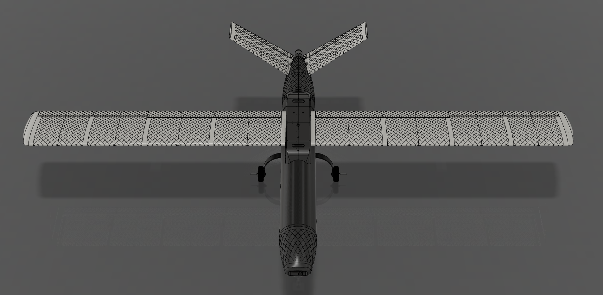
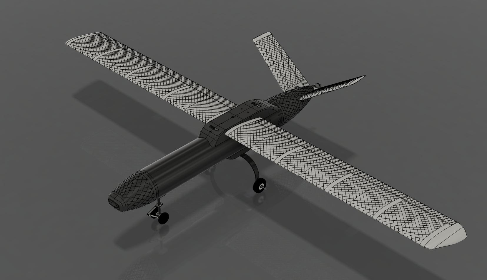
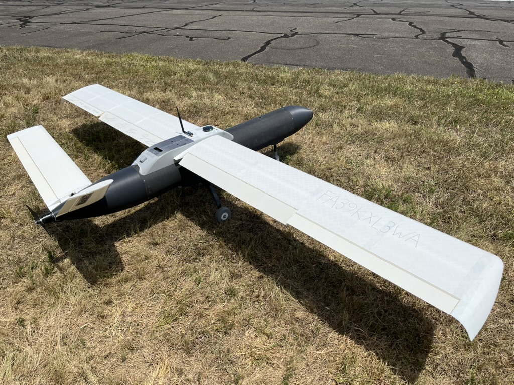

# Air Taxi CAD Model

I created this CAD model of a fixed wing UAV for the SUAS 2024 student competition.

Specifications:
- Wingspan: 3.65 m
- Length: 2 m
- Cruise speed: 80-100 km/h
- MTOW: 15 kg

The renders of the CAD model can be seen below:

Here's a photograph of the actual UAV:

